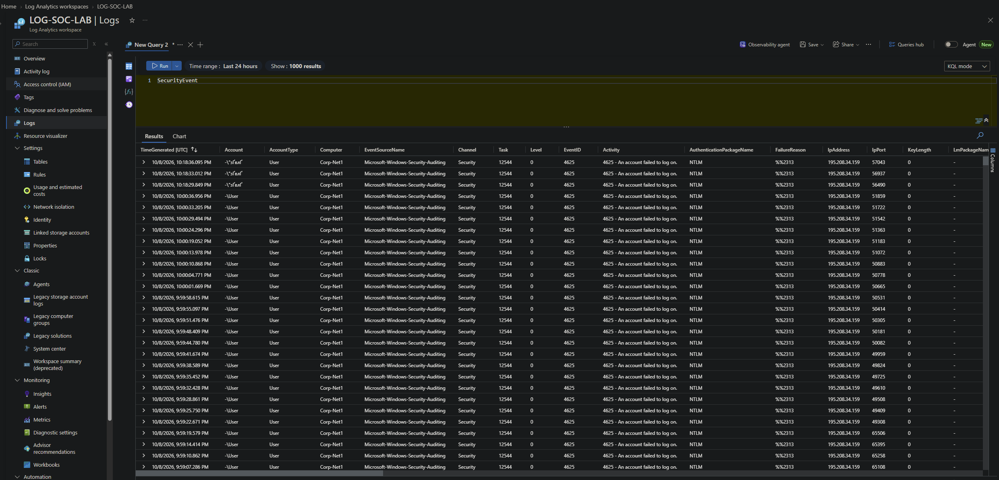
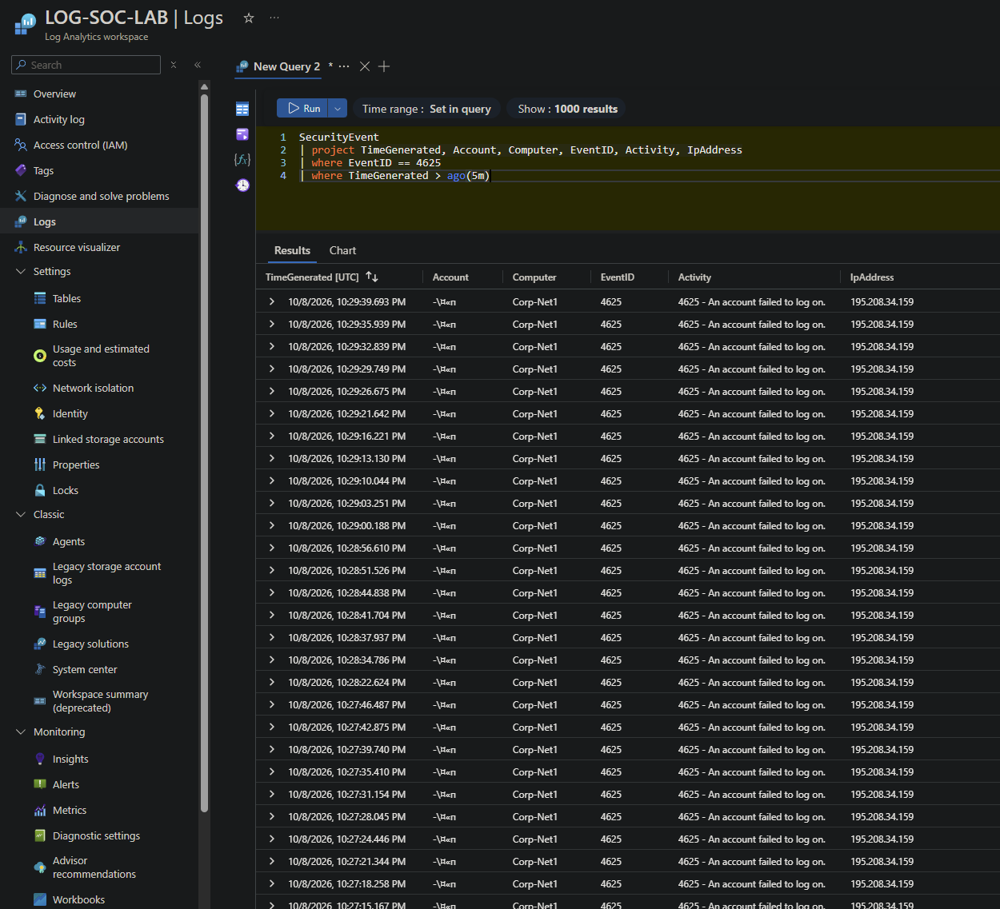
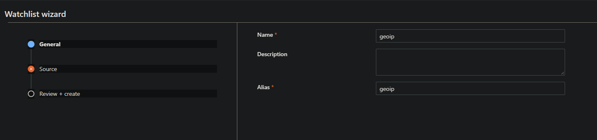
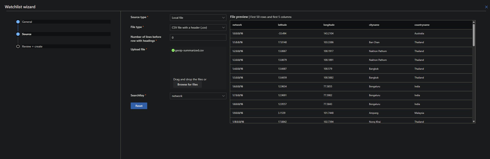

# Microsoft Sentinel Honeypot — Windows VM Attack Map

**Azure | Microsoft Sentinel | Log Analytics | Azure Monitor Agent | KQL | Threat Detection**

## Project Overview

This project demonstrates how to deploy a Windows honeypot in Microsoft Azure, collect Windows Security Events, and monitor suspicious authentication activity using Microsoft Sentinel.

I created a Windows virtual machine configured as a honeypot, forwarded its security logs to an Azure Log Analytics workspace, and integrated the workspace with Microsoft Sentinel.

Using Kusto Query Language (KQL) and a GeoIP watchlist, I developed an interactive geographic attack map that displays the approximate locations associated with failed login attempts.

During the initial monitoring period of approximately three hours, the honeypot recorded approximately **1,700 geographically mapped failed login events across four locations**.

These results demonstrate how cloud-based security monitoring tools can help security analysts identify suspicious authentication patterns, investigate security events, and visualize potential threats.

> **Security Notice:** This project was performed in an isolated, disposable lab environment. The intentionally permissive network and firewall configurations are not appropriate for production environments.

---

## Table of Contents

1. [Project Architecture](#project-architecture)
2. [Project Objectives](#project-objectives)
3. [Technologies Used](#technologies-used)
4. [Step 1: Deploy the Windows Virtual Machine](#step-1-deploy-the-windows-virtual-machine)
5. [Step 2: Configure Inbound Security Rules](#step-2-configure-inbound-security-rules)
6. [Step 3: Connect to the Virtual Machine](#step-3-connect-to-the-virtual-machine)
7. [Step 4: Configure Windows Firewall and Test Connectivity](#step-4-configure-windows-firewall-and-test-connectivity)
8. [Step 5: Generate and Analyze Failed Login Attempts](#step-5-generate-and-analyze-failed-login-attempts)
9. [Step 6: Create Log Analytics Workspace](#step-6-create-log-analytics-workspace)
10. [Step 7: Integrate Microsoft Sentinel](#step-7-integrate-microsoft-sentinel)
11. [Step 8: Install Windows Security Events Connector](#step-8-install-windows-security-events-connector)
12. [Step 9: Create a Data Collection Rule](#step-9-create-a-data-collection-rule)
13. [Step 10: Verify Azure Monitor Agent](#step-10-verify-azure-monitor-agent)
14. [Step 11: Analyze Security Logs Using KQL](#step-11-analyze-security-logs-using-kql)
15. [Step 12: Create a GeoIP Watchlist](#step-12-create-a-geoip-watchlist)
16. [Step 13: Create the Honeypot Attack Map](#step-13-create-the-honeypot-attack-map)
17. [Security Findings](#security-findings)
18. [Challenges and Troubleshooting](#challenges-and-troubleshooting)
19. [Lessons Learned](#lessons-learned)
20. [Security Considerations and Cleanup](#security-considerations-and-cleanup)
21. [Conclusion](#conclusion)

---

## Project Architecture

The following illustrates how Windows Security Events are collected, forwarded, enriched, and visualized using Microsoft Sentinel.

```text
        Internet Authentication Attempts
                      |
                      v
          Microsoft Azure Windows VM
                (Honeypot)
                      |
                      v
             Windows Event Viewer
             Security Event ID 4625
                      |
                      v
              Azure Monitor Agent
                     (AMA)
                      |
                      v
             Data Collection Rule
               All Security Events
                      |
                      v
            Log Analytics Workspace
                 LOG-SOC-LAB
                      |
                      v
               Microsoft Sentinel
                      |
                      v
              KQL Security Analysis
                      |
                      +--------------------+
                      |                    |
                      v                    v
             Security Events       GeoIP Watchlist
                                   (CSV Dataset)
                      |                    |
                      +---------+----------+
                                |
                                v
                         IP Enrichment
                         ipv4_lookup()
                                |
                                v
                       Sentinel Workbook
                       Geographic Attack Map
```

### Lab Environment

| Component | Configuration |
|---|---|
| Cloud Platform | Microsoft Azure |
| Virtual Machine | Corp-Net1 |
| Operating System | Windows 11 Pro |
| VM Size | Standard D2als v6 |
| Azure Region | East US 2 |
| Resource Group | SOC-LAB |
| Log Analytics Workspace | LOG-SOC-LAB |
| Data Collection Rule | Windows11-LOG |
| Log Collection Agent | AzureMonitorWindowsAgent |
| SIEM Platform | Microsoft Sentinel |
| GeoIP Watchlist Alias | geoip |
| Primary Security Event | Event ID 4625 |

---

## Project Objectives

The objectives of this project were to:

- Deploy a Windows virtual machine in Azure to act as a honeypot.
- Configure the lab environment to observe unsolicited authentication activity.
- Generate and examine Windows Security Events using Event Viewer.
- Create a centralized log repository using Azure Log Analytics.
- Integrate Microsoft Sentinel with the Log Analytics workspace.
- Configure Azure Monitor Agent and Data Collection Rules.
- Analyze Windows authentication events using KQL.
- Identify IP addresses associated with repeated authentication failures.
- Enrich security events with geographic information using a GeoIP watchlist.
- Create an interactive geographic attack map.
- Develop practical skills in SIEM operations, threat monitoring, and cloud security.

---

## Technologies Used

| Technology | Purpose |
|---|---|
| Microsoft Azure | Cloud infrastructure hosting |
| Azure Virtual Machines | Windows honeypot environment |
| Network Security Groups | Network traffic filtering |
| Azure Bastion | Secure remote administration |
| Remote Desktop Protocol | Remote Windows access |
| Windows Event Viewer | Local security event investigation |
| Azure Log Analytics | Centralized log storage and analysis |
| Microsoft Sentinel | Security Information and Event Management |
| Azure Monitor Agent | Windows Security Event collection |
| Data Collection Rules | Configure security event forwarding |
| Kusto Query Language | Query and analyze security events |
| Microsoft Sentinel Watchlists | Geographic IP reference data |
| Microsoft Sentinel Workbooks | Interactive security dashboards |

---

# Implementation

## Step 1: Deploy the Windows Virtual Machine

The first step involved creating a Windows virtual machine in Microsoft Azure.

The VM served as the honeypot, allowing me to observe authentication activity and collect Windows Security Events.

After deploying the virtual machine, I verified its configuration through the Azure Portal.

### Virtual Machine Configuration

- Virtual Machine Name: Corp-Net1
- Operating System: Windows 11 Pro
- Azure Region: East US 2
- Purpose: Honeypot security monitoring

For detailed instructions on creating a Windows virtual machine in Azure, refer to my previous project:

**[Azure Virtual Machine Deployment Guide](PASTE_VM_DEPLOYMENT_GUIDE_URL_HERE)**

### Screenshot: Azure Virtual Machine


[Back to Top](#table-of-contents)

---

## Step 2: Configure Inbound Security Rules

After creating the virtual machine, I configured inbound security rules through Azure Network Security Groups.

For this experiment, I created a permissive inbound rule allowing traffic from any source.

This allowed the honeypot to receive unsolicited network traffic and authentication attempts.

### Inbound Security Rule Configuration

| Setting | Value |
|---|---|
| Source | Any |
| Source Port Ranges | * |
| Destination | Any |
| Destination Port Ranges | * |
| Protocol | Any |
| Action | Allow |
| Priority | 100 |

The intentionally permissive configuration increased the VM's exposure to unsolicited internet traffic.

**Security Note:** Allowing unrestricted inbound traffic introduces substantial risk. This configuration should only be used in an isolated, disposable honeypot environment. Production systems should restrict access to necessary ports and authorized IP addresses.

### Screenshot: Creating the Inbound Security Rule


### Screenshot: Verifying the Inbound Security Rule


[Back to Top](#table-of-contents)

---

## Step 3: Connect to the Virtual Machine

After configuring the network security rules, I connected to the Windows virtual machine.

Two available connection methods were:

1. Azure Bastion
2. Remote Desktop Connection (RDP)

### Method 1: Azure Bastion

Azure Bastion provides remote access to virtual machines through the Azure Portal without requiring a public RDP endpoint for administration.

I navigated to:

**Azure Portal → Virtual Machines → Corp-Net1 → Connect → Bastion**

From the Bastion connection page, I entered the appropriate authentication credentials to access the virtual machine.

### Screenshot: Azure Bastion Connection


### Method 2: Remote Desktop Connection

Remote Desktop Connection allows administrators to connect to Windows systems remotely.

I used Remote Desktop Connection to access the VM using its public IP address and valid credentials.

### Screenshot: Remote Desktop Connection


Remote Desktop connections may display a certificate warning when the remote system's certificate cannot be validated.

In production environments, certificate warnings should be investigated before establishing a connection.

[Back to Top](#table-of-contents)

---

## Step 4: Configure Windows Firewall and Test Connectivity

After connecting to the VM, I opened Windows Defender Firewall with Advanced Security.

For the controlled honeypot experiment, I temporarily disabled the Windows Firewall profiles to allow more inbound network traffic.

The firewall configuration included:

- Domain Profile: Off
- Private Profile: Off
- Public Profile: Off

This was performed only for the isolated honeypot experiment.

### Screenshot: Windows Defender Firewall Configuration


### Network Connectivity Verification

Next, I used PowerShell on my host computer to test network connectivity with the virtual machine.

The command used was:

```powershell
ping <VM_PUBLIC_IP>
```

The command sends ICMP echo requests to the destination IP address.

Receiving a response indicates that the destination was reachable using ICMP at the time of the test.

However, successful ping responses do not necessarily verify that RDP or other applications are accessible.

### Screenshot: Ping Verification


[Back to Top](#table-of-contents)

---

## Step 5: Generate and Analyze Failed Login Attempts

To verify that Windows was recording unsuccessful authentication attempts, I deliberately attempted to log into the VM using incorrect credentials approximately four to five times.

After generating the failed login attempts, I logged into the VM using valid credentials.

I opened Windows Event Viewer and navigated to:

**Event Viewer → Windows Logs → Security**

Windows Event Viewer contains information about security-related activities occurring within the operating system.

### Windows Security Event IDs

| Event ID | Description |
|---|---|
| 4625 | Failed account login |
| 4624 | Successful account login |

For this project, **Event ID 4625** was the primary event used to identify unsuccessful authentication attempts.

### Filtering Failed Login Events

I filtered the Windows Security log to display events associated with Event ID 4625.

### Screenshot: Event Viewer Failed Logins


### Examining Event Properties

Selecting an individual event provides additional information about the authentication attempt.

Useful information includes:

- Event timestamp
- Account name
- Authentication failure reason
- Logon type
- Source IP address, when available
- Authentication package
- Additional network information

The illustrated event includes Logon Type 3, indicating a network logon attempt.

### Screenshot: Failed Login Event Details


These events confirmed that the operating system was recording unsuccessful authentication activity.

[Back to Top](#table-of-contents)

---

## Step 6: Create Log Analytics Workspace

The next step was to create a centralized log repository using Azure Log Analytics.

Log Analytics allows security administrators to collect, store, search, and investigate log data from connected resources.

Instead of reviewing authentication logs exclusively through the VM's local Event Viewer, I configured a centralized workspace for security monitoring.

### Configuration Steps

1. Open the Azure Portal.
2. Search for **Log Analytics workspaces**.
3. Select **Create**.
4. Choose the Azure subscription.
5. Select the resource group.
6. Enter the workspace name.
7. Select the Azure region.
8. Review and create the workspace.

### Workspace Configuration

| Setting | Value |
|---|---|
| Subscription | Azure subscription 1 |
| Resource Group | SOC-LAB |
| Workspace Name | LOG-SOC-LAB |
| Region | East US 2 |

### Screenshot: Creating Log Analytics Workspace


This workspace served as the central repository for security logs collected from the honeypot VM.

[Back to Top](#table-of-contents)

---

## Step 7: Integrate Microsoft Sentinel

After creating the Log Analytics workspace, I integrated Microsoft Sentinel.

Microsoft Sentinel is a cloud-native SIEM solution used to monitor, detect, investigate, and respond to security threats.

It uses data collected from connected sources to support security investigations and threat detection.

### Configuration Steps

1. Open the Azure Portal.
2. Search for **Microsoft Sentinel**.
3. Select **Create**.
4. Choose the existing Log Analytics workspace.
5. Add Microsoft Sentinel to the workspace.

For this project, I selected the previously created workspace:

`LOG-SOC-LAB`

### Screenshot: Link Log Analytics Workspace to Microsoft Sentinel


After completing the integration, I proceeded with configuring Windows Security Event collection.

[Back to Top](#table-of-contents)

---

## Step 8: Install Windows Security Events Connector

The next step was to configure the Windows Security Events solution so that Windows authentication logs could be forwarded to Log Analytics.

Microsoft Sentinel provides the **Windows Security Events via AMA** connector.

AMA stands for Azure Monitor Agent.

### Configuration Steps

1. Open Microsoft Sentinel.
2. Navigate to **Content Management → Content Hub**.
3. Search for **Windows Security Events**.
4. Select the solution.
5. Click **Install**.
6. After installation, select **Manage**.
7. Locate **Windows Security Events via AMA**.
8. Click **Open Connector Page**.

### Screenshot: Windows Security Events Installation


### Screenshot: Windows Security Events via AMA


The connector allows Windows Security Events to be collected through Azure Monitor Agent and a Data Collection Rule.

The presence of the installed connector alone does not confirm successful log ingestion. Actual security events must be verified through Log Analytics.

[Back to Top](#table-of-contents)

---

## Step 9: Create a Data Collection Rule

After installing the Windows Security Events connector, I created a Data Collection Rule.

A Data Collection Rule defines which data should be collected from a monitored resource.

In this project, the rule was configured to collect Windows Security Events from the honeypot virtual machine.

### Part 1: Basic Configuration

I selected **Create Data Collection Rule** and configured the rule information.

### Data Collection Rule Settings

| Setting | Value |
|---|---|
| Rule Name | Windows11-LOG |
| Subscription | Azure subscription 1 |
| Resource Group | SOC-LAB |

### Screenshot: Data Collection Rule Basic Configuration


### Part 2: Select Resources

Next, I navigated to the Resources tab.

I selected the Windows virtual machine created earlier in the project.

**Selected VM:** `Corp-Net1`

Selecting this resource allows the monitoring configuration to collect events from the honeypot VM.

### Screenshot: Data Collection Rule Resource Selection


### Part 3: Configure Security Event Collection

After selecting the VM, I navigated to the Collect tab.

The available security event collection options included:

- All Security Events
- Common
- Minimal
- Custom

For this project, I selected:

**All Security Events**

This configuration allowed a broad set of Windows security events to be collected for analysis.

### Screenshot: All Security Events Selected


Finally, I reviewed the settings and created the Data Collection Rule.

**Important:** Collecting all security events can increase Log Analytics ingestion costs. Production environments should consider requirements-based event collection.

[Back to Top](#table-of-contents)

---

## Step 10: Verify Azure Monitor Agent

After creating the Data Collection Rule, I verified that Azure Monitor Agent had been installed on the virtual machine.

### Verification Steps

1. Open the Azure Portal.
2. Navigate to **Virtual Machines**.
3. Select **Corp-Net1**.
4. Open **Settings → Extensions + Applications**.
5. Verify that Azure Monitor Agent is installed.

The installed extension appeared as:

```text
AzureMonitorWindowsAgent
```

The extension status showed that provisioning succeeded.

### Screenshot: Azure Monitor Agent Extension


This confirmed that the monitoring agent was installed.

I then verified the actual security logs through Log Analytics.

[Back to Top](#table-of-contents)

---

## Step 11: Analyze Security Logs Using KQL

After configuring the Azure Monitor Agent and Data Collection Rule, Windows Security Events began appearing in the Log Analytics workspace.

I used **Kusto Query Language (KQL)** to retrieve and analyze the collected events.

KQL allows security analysts to filter, summarize, and investigate large volumes of security telemetry.

### Query 1: Retrieve Windows Security Events

```kql
SecurityEvent
```

This query retrieves security events stored in the `SecurityEvent` table.

### Screenshot: Windows Security Logs in Log Analytics



### Query 2: Filter Failed Login Attempts

To focus specifically on unsuccessful authentication attempts, I filtered for Event ID 4625.

```kql
SecurityEvent
| where EventID == 4625
| project TimeGenerated, Account, Computer, EventID, Activity, IpAddress
| order by TimeGenerated desc
```

### Query Explanation

| KQL Component | Purpose |
|---|---|
| SecurityEvent | Retrieves Windows Security Event logs |
| where EventID == 4625 | Filters failed authentication events |
| project | Selects important log fields |
| order by | Sorts events by timestamp |

### Screenshot: Failed Login Events Filtered Using KQL



### Query 3: Count Failed Logins by Source IP Address

```kql
SecurityEvent
| where EventID == 4625
| where isnotempty(IpAddress)
| summarize FailedAttempts = count() by IpAddress
| order by FailedAttempts desc
```

This query identifies source IP addresses associated with repeated unsuccessful authentication attempts.

A high number of failures from an individual IP address may indicate automated credential guessing or brute-force activity.

However, additional investigation is required before confirming malicious intent.

### Query 4: Identify Successful Logins

```kql
SecurityEvent
| where EventID == 4624
| project TimeGenerated, Computer, Account, IpAddress, LogonType
| order by TimeGenerated desc
```

This query identifies successful authentication events.

For investigating successful Remote Desktop logons, Logon Type 10 is particularly relevant.

[Back to Top](#table-of-contents)

---

## Step 12: Create a GeoIP Watchlist

After collecting and analyzing the security logs, I prepared to visualize failed login attempts geographically.

Windows Security Events may include source IP addresses, but they do not typically contain city names, countries, latitude, or longitude.

To enrich the collected events with geographic information, I imported a GeoIP CSV file into Microsoft Sentinel Watchlists.

### GeoIP Dataset

The dataset contained the following fields:

| Column | Description |
|---|---|
| network | IPv4 network range |
| latitude | Geographic latitude |
| longitude | Geographic longitude |
| cityname | City associated with IP range |
| countryname | Country associated with IP range |

### CSV File Used in This Project

**[View GeoIP CSV Dataset](data/geoip-summarized.csv)**

The CSV file used in this project was:

`geoip-summarized.csv`

This file was imported into Microsoft Sentinel to associate source IP addresses with approximate geographic locations.

### Screenshot: GeoIP Spreadsheet


### Watchlist Configuration Steps

1. Open Microsoft Sentinel.
2. Navigate to **Configuration → Watchlists**.
3. Open the Microsoft Defender portal.
4. Select **New**.
5. Enter the watchlist name.
6. Enter the watchlist alias.
7. Navigate to the Source page.
8. Upload the GeoIP CSV file.
9. Select `network` as the SearchKey.
10. Review and create the watchlist.

### Watchlist General Configuration

| Setting | Value |
|---|---|
| Name | geoip |
| Alias | geoip |
| Source Type | Local File |
| File Type | CSV with header |
| SearchKey | network |

### Screenshot: GeoIP Watchlist Name and Alias



### Screenshot: Upload GeoIP CSV



The imported dataset included approximately 55,000 geographic reference entries.

### Screenshot: GeoIP Watchlist Import Completed


### Understanding the Watchlist

The watchlist contains approximately **55,000 reference records**.

These entries represent IP network ranges and their associated geographic information.

They do not represent 55,000 attacks.

Microsoft Sentinel uses these records to match IP addresses found in Windows Security Events with approximate geographic locations.

> **Dataset Attribution:** Before publishing the original GeoIP dataset in a public repository, confirm that redistribution is permitted and acknowledge the original source where required.

[Back to Top](#table-of-contents)

---

## Step 13: Create the Honeypot Attack Map

After successfully importing the GeoIP watchlist, I created a Microsoft Sentinel Workbook to visualize failed login attempts geographically.

The workbook combines Windows Security Events with geographic information stored in the GeoIP watchlist.

### Configuration Steps

1. Open Microsoft Sentinel.
2. Navigate to **Threat Management → Workbooks**.
3. Open the Microsoft Defender portal.
4. Select **Add Workbook**.
5. Click **Edit**.
6. Remove unnecessary prepopulated components.
7. Select **Add Data Source + Visualization**.
8. Configure the query using Logs (Analytics).
9. Enter the KQL query.
10. Run the query.
11. Select the Map visualization.
12. Configure latitude, longitude, and failure count.
13. Save the workbook.

### KQL Query: Geographic Attack Map

```kql
let GeoIPDB_FULL = _GetWatchlist("geoip");
let WindowsEvents = SecurityEvent;

WindowsEvents
| where EventID == 4625
| order by TimeGenerated desc
| evaluate ipv4_lookup(GeoIPDB_FULL, IpAddress, network)
| summarize FailureCount = count()
    by IpAddress, latitude, longitude, cityname, countryname
| project
    FailureCount,
    AttackerIp = IpAddress,
    latitude,
    longitude,
    city = cityname,
    country = countryname,
    friendly_location = strcat(cityname, " (", countryname, ")")
```

### Query Explanation

**1. Retrieve Geographic Reference Data**

```kql
let GeoIPDB_FULL = _GetWatchlist("geoip");
```

Retrieves the GeoIP watchlist previously imported into Microsoft Sentinel.

**2. Retrieve Windows Security Events**

```kql
let WindowsEvents = SecurityEvent;
```

References the Windows Security Events stored in Log Analytics.

**3. Filter Failed Logins**

```kql
| where EventID == 4625
```

Filters the data to show unsuccessful Windows authentication attempts.

**4. Match IP Addresses With Geographic Data**

```kql
| evaluate ipv4_lookup(GeoIPDB_FULL, IpAddress, network)
```

Matches source IP addresses with network ranges in the imported GeoIP watchlist.

**5. Count Authentication Failures**

```kql
| summarize FailureCount = count()
    by IpAddress, latitude, longitude, cityname, countryname
```

Counts failed login events associated with each IP address and geographic location.

**6. Prepare Geographic Visualization**

```kql
| project
    FailureCount,
    AttackerIp = IpAddress,
    latitude,
    longitude,
    city = cityname,
    country = countryname,
    friendly_location = strcat(cityname, " (", countryname, ")")
```

Prepares the geographic coordinates and location labels required for map visualization.

---

### Workbook JSON Configuration

In addition to using KQL, I configured the Microsoft Sentinel Workbook visualization using its JSON configuration.

This configuration specifies the query, geographic coordinates, failure counts, map visualization, and heatmap settings.

**[View Workbook JSON Configuration](workbooks/attack-map-query-item.json)**

The following JSON was used for the workbook query item:

```json
{
    "type": 3,
    "content": {
        "version": "KqlItem/1.0",
        "query": "let GeoIPDB_FULL = _GetWatchlist(\"geoip\");\nlet WindowsEvents = SecurityEvent;\nWindowsEvents | where EventID == 4625\n| order by TimeGenerated desc\n| evaluate ipv4_lookup(GeoIPDB_FULL, IpAddress, network)\n| summarize FailureCount = count() by IpAddress, latitude, longitude, cityname, countryname\n| project FailureCount, AttackerIp = IpAddress, latitude, longitude, city = cityname, country = countryname,\nfriendly_location = strcat(cityname, \" (\", countryname, \")\");",
        "size": 3,
        "timeContext": {
            "durationMs": 2592000000
        },
        "queryType": 0,
        "resourceType": "microsoft.operationalinsights/workspaces",
        "visualization": "map",
        "mapSettings": {
            "locInfo": "LatLong",
            "locInfoColumn": "countryname",
            "latitude": "latitude",
            "longitude": "longitude",
            "sizeSettings": "FailureCount",
            "sizeAggregation": "Sum",
            "opacity": 0.8,
            "labelSettings": "friendly_location",
            "legendMetric": "FailureCount",
            "legendAggregation": "Sum",
            "itemColorSettings": {
                "nodeColorField": "FailureCount",
                "colorAggregation": "Sum",
                "type": "heatmap",
                "heatmapPalette": "greenRed"
            }
        }
    },
    "name": "query - 0"
}
```

**Important:** This is a workbook query-item JSON configuration, not a standalone KQL query. The JSON belongs in the workbook query item's Advanced Editor, not the standard KQL query field. The workbook must also be associated with the correct Log Analytics workspace.

### Map Visualization Settings

| Setting | Configuration |
|---|---|
| Visualization Type | Map |
| Location Information | Latitude / Longitude |
| Latitude Column | latitude |
| Longitude Column | longitude |
| Label | friendly_location |
| Size Metric | FailureCount |
| Aggregation | Sum |
| Color Metric | FailureCount |
| Color Palette | Green to Red |

The resulting map displays geographic markers representing locations associated with failed authentication events.

Locations with higher failure counts appear more prominent depending on the configured visualization settings.

### Screenshot: Completed Microsoft Sentinel Honeypot Attack Map


The attack map uses approximate IP geolocation information.

It does not identify an attacker's precise physical location.

[Back to Top](#table-of-contents)

---

# Security Findings

During the initial monitoring period of approximately three hours, the honeypot collected numerous failed authentication events.

The Microsoft Sentinel workbook displayed approximately **1,700 geographically matched failed login events**.

### Initial Geographic Findings

| Geographic Location | Failed Login Events |
|---|---:|
| Wrexham, United Kingdom | Approximately 1,620 |
| Trà Vinh, Vietnam | 36 |
| Safford, United States | 1 |
| Ephrata, United States | 1 |
| **Total** | **Approximately 1,700** |

### Key Observations

- The publicly exposed Windows VM received repeated unsuccessful authentication attempts.
- Windows Security Event ID 4625 provided information about authentication failures.
- Log Analytics centralized security events collected from the honeypot.
- KQL enabled filtering and investigation of failed authentication events.
- GeoIP enrichment added approximate geographic context to the source IP addresses.
- Microsoft Sentinel Workbooks transformed security events into an interactive geographic visualization.

### Understanding the Difference Between Watchlist and Attack Counts

The GeoIP watchlist contained approximately 55,000 entries, while the attack map displayed approximately 1,700 failed login events.

These values measure different things.

**GeoIP Watchlist:**

Contains geographic reference information associated with IP address ranges.

**Attack Map:**

Displays the count of failed authentication events that meet the KQL filtering criteria and successfully match geographic information.

Not every Windows Security Event necessarily has a usable public source IP address or matching GeoIP record.

Therefore, the number of geographically mapped authentication events may be lower than the total number of authentication events collected.

### Security Interpretation

A large number of unsuccessful login attempts originating from the same source IP address may indicate automated password guessing or brute-force activity.

However, failed authentication events alone do not prove that a system has been compromised.

Additional analysis of source IP addresses, account names, timestamps, and authentication patterns is necessary before drawing conclusions.

---

# Challenges and Troubleshooting

## Challenge 1: Missing Geographic Information

**Problem:**

Windows Security Event logs contained source IP addresses but did not provide latitude, longitude, or other geographic details.

**Solution:**

Imported a GeoIP CSV dataset into Microsoft Sentinel Watchlists and used KQL's `ipv4_lookup()` operator to associate source IP addresses with geographic reference records.

---

## Challenge 2: Workbook Query Parsing Error

**Problem:**

The workbook initially displayed a query parsing error because JSON configuration was entered into the KQL query editor.

**Solution:**

Separated the KQL statement from the workbook's JSON configuration.

KQL was entered into the query editor, while the workbook item JSON was placed in the appropriate Advanced Editor.

---

## Challenge 3: Different Watchlist and Attack Counts

**Problem:**

The GeoIP watchlist displayed approximately 55,000 records, while the attack map displayed approximately 1,700 failed authentication events.

**Explanation:**

The watchlist contains geographic reference data rather than authentication logs.

The workbook counts actual failed authentication events associated with geographic records.

---

## Challenge 4: Verifying Windows Security Event Collection

**Problem:**

Installing the Windows Security Events connector did not automatically demonstrate that authentication logs were successfully reaching Log Analytics.

**Solution:**

Verified the Azure Monitor Agent extension and executed KQL queries against the `SecurityEvent` table to confirm that Windows authentication events were being received.

---

## Challenge 5: Visualizing Security Data

**Problem:**

Raw Windows Security Event logs were difficult to interpret geographically.

**Solution:**

Created a Microsoft Sentinel Workbook using geographic coordinates, aggregated authentication failure counts, and map visualization settings.

This provided a clearer representation of the approximate geographic distribution of authentication events.

---

# Lessons Learned

Completing this project provided practical experience with cloud security monitoring, Windows Security Event collection, SIEM integration, and threat visualization.

## 1. Centralized Log Collection

I learned how to configure Azure Monitor Agent and Data Collection Rules to collect Windows Security Events from an Azure virtual machine.

Centralized logging allows security analysts to investigate events without accessing each monitored computer individually.

## 2. Microsoft Sentinel SIEM Integration

I gained hands-on experience configuring Microsoft Sentinel with Azure Log Analytics.

This demonstrated how a SIEM platform can centralize security telemetry and support security investigations.

## 3. Kusto Query Language

I practiced using KQL to retrieve security events, filter failed authentication attempts, identify source IP addresses, and summarize event counts.

This improved my understanding of security log investigation and data analysis.

## 4. Threat Intelligence Enrichment

I learned how external geographic reference data can be used to enrich collected security logs.

The GeoIP watchlist provided additional context for source IP addresses that would otherwise lack geographic information.

## 5. Security Data Visualization

I gained experience creating a Microsoft Sentinel Workbook and configuring an interactive geographic attack map.

This demonstrated how security information can be presented visually to support investigation and reporting.

## 6. Honeypot Monitoring

The project demonstrated how exposed cloud systems may receive repeated unsolicited authentication attempts.

I also learned the importance of distinguishing between suspicious activity, failed authentication events, and confirmed security incidents.

## 7. Troubleshooting Security Monitoring Systems

I improved my troubleshooting skills while investigating workbook parsing errors, geographic data enrichment, and differences between log counts and reference datasets.

---

# Security Considerations and Cleanup

This honeypot was intentionally configured with insecure settings for educational purposes.

The environment should not be used to store sensitive information, production credentials, or business data.

### Recommended Cleanup

1. Stop and deallocate the Windows virtual machine after completing the experiment.
2. Remove unnecessarily permissive inbound security rules.
3. Re-enable Windows Defender Firewall if the VM will be retained.
4. Restrict or remove unneeded public network exposure.
5. Delete unused Azure resources when no longer required.
6. Review Log Analytics and Microsoft Sentinel ingestion costs.
7. Monitor Azure Cost Management for outstanding resource charges.

**Azure Billing Note:**

Stopping and deallocating a VM generally stops its compute charges, but managed disks, certain networking resources, and monitoring services may continue generating charges.

---

# Conclusion

The Microsoft Sentinel Honeypot Project demonstrates the practical implementation of a cloud-based security monitoring environment.

By deploying a Windows virtual machine in Microsoft Azure, configuring Azure Monitor Agent and Data Collection Rules, integrating Log Analytics with Microsoft Sentinel, and analyzing Windows Security Events using KQL, I developed a centralized workflow for monitoring authentication activity.

Additionally, importing GeoIP reference data and creating a Microsoft Sentinel Workbook allowed me to visualize the approximate geographic origins of failed authentication events.

This project strengthened my knowledge and hands-on skills in:

- Security Information and Event Management (SIEM)
- Microsoft Azure Security
- Windows Security Event Analysis
- Cloud-Based Log Collection
- Kusto Query Language
- Authentication Monitoring
- Geographic Threat Intelligence Enrichment
- Security Investigation
- Security Data Visualization
- SOC Analyst Operations

These technologies and skills are directly relevant to cybersecurity operations, cloud security monitoring, and Security Operations Center environments.

---

# Repository Structure

```text
Microsoft-Sentinel-Honeypot/
│
├── README.md
│
├── images/
│   ├── VM Creation.png
│   ├── Inbound Security Rule.png
│   ├── Inbound Security Rule Verification.png
│   ├── Connection to VM through Bastion.png
│   ├── Remote Desktop Connection Method.png
│   ├── Windows Firewall Disable.png
│   ├── Ping VM IP Address.png
│   ├── Event Viewer Failed Login Logs.png
│   ├── Failed Login Details.png
│   ├── Create Log Analytics Workspace.png
│   ├── Link Log Workspace to Sentinel.png
│   ├── Windows Security Event Installation.png
│   ├── Windows Security Event via AMA.png
│   ├── Data Collection Rule.png
│   ├── Data Collection Rule2.png
│   ├── Data Collection Rule3.png
│   ├── Extensions + applications.png
│   ├── Win11-logs.png
│   ├── Win11-logs-Filter.png
│   ├── SpreadSheets with all the information.png
│   ├── geoip1.png
│   ├── geoip2.png
│   ├── geoip upload complete.png
│   └── Failed Login Attack Map.png
│
├── data/
│   └── geoip-summarized.csv
│
├── workbooks/
│   └── attack-map-query-item.json
│
└── queries/
    ├── failed-login-events.kql
    ├── failed-login-counts.kql
    ├── successful-logins.kql
    └── geoip-honeypot-attack-map.kql
```

---

**Project Category:** Cloud Security / Microsoft Sentinel / SIEM / Honeypot

**Key Skills:** Azure Security | KQL | Threat Monitoring | Log Analytics | Security Event Analysis | SOC Operations
